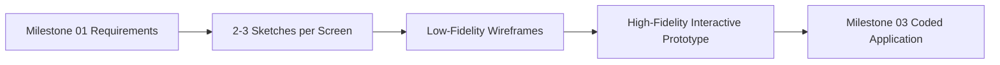
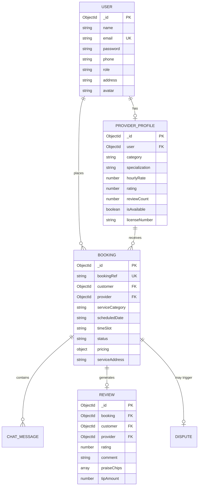
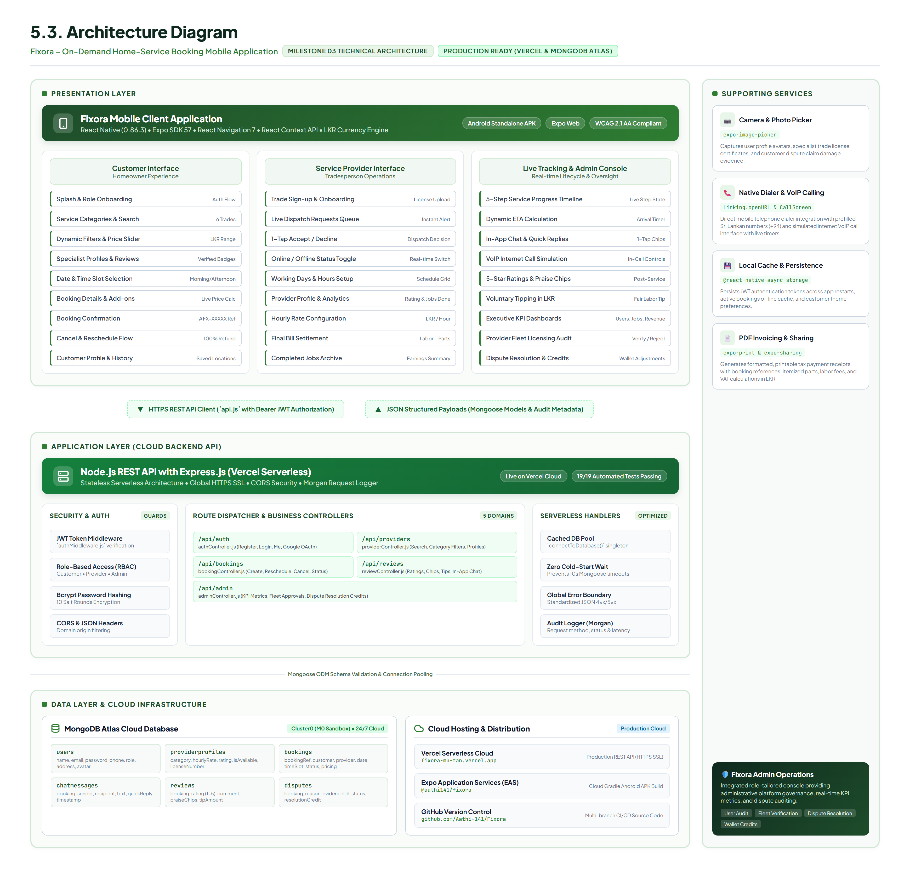
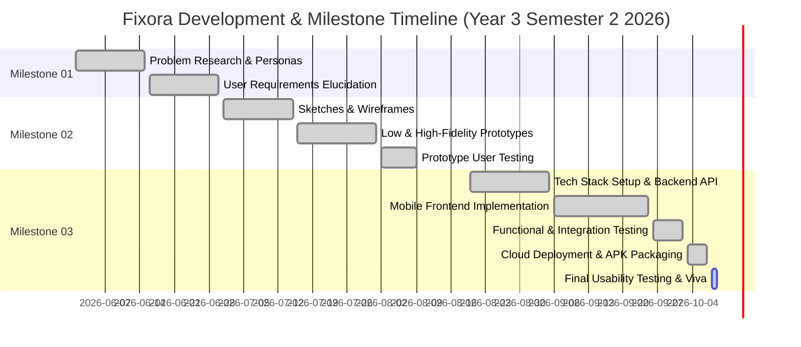

# IT3060 Human Computer Interaction
## Milestones 01–03 Consolidated Final Report

---

### Project Information
- **Module Code & Title:** IT3060 – Human Computer Interaction
- **Academic Period:** Year 3 Semester 2 (2026)
- **Project Title:** Fixora – On-Demand Home-Service Booking Mobile Application
- **Group Number:** Group 130
- **Group Name:** Fixora Project Group
- **Repository URL:** [https://github.com/Aathi-141/Fixora.git](https://github.com/Aathi-141/Fixora.git)
- **Live Cloud API:** `https://fixora-mu-tan.vercel.app`
- **Submission Date:** October 2026

### Group Member Details & Workload Distribution
| Student ID | Student Name | Assigned Modules & Workload Distribution | Working CRUD Operations Implemented |
|---|---|---|---|
| **IT23861022** | **Pushpakumara G.K.M.P** (Manusha) | **Member 1: Onboarding, Discovery & Specialist Profiles**<br>• Splash, Account Type Selection, Customer Sign-up, Provider Sign-up, Login.<br>• Home Screen (Search & Categories), Dynamic Multi-Filter Sheet, Provider Profile.<br>• Usability Testing Execution & Evaluation. | **CREATE**: Customer & Provider Account Registration<br>**READ**: Search & Category Querying, Provider Details<br>**UPDATE**: User Credential & Role State |
| **IT23546202** | **Aathika M.A.F** | **Member 2: Service Booking Flow & Customer Profile**<br>• Date & Time Selection, Booking Details (Add-ons & Pricing), Booking Successful Confirmation.<br>• Manage Booking (Reschedule & Cancellation with 100% Refund).<br>• Customer Profile Management.<br>• Requirements Traceability Matrix, Gantt Chart, Usability Testing Execution. | **CREATE**: New Service Booking Creation with Add-ons<br>**READ**: Scheduled Appointments & Profile Details<br>**UPDATE**: Reschedule Appointment Date/Time Slot, Edit Customer Profile<br>**DELETE**: Cancel Booking with Refund Logic |
| **IT23843202** | **Basnayaka B.M.A.S.S** (Shakya) | **Member 3: Status Tracking, In-App Chat, Calling & Reviews**<br>• Request Status Tracking (Live Progress Timeline & Dynamic ETA).<br>• In-App Chat (Suggested 1-Tap Quick Replies).<br>• VoIP Internet Calling Simulation.<br>• Ratings & Reviews (1–5 Star, Praise Chips, Voluntary Tip).<br>• Service Request History (Ongoing & Completed tabs, Payment Receipts).<br>• Usability Testing Execution. | **CREATE**: Send Chat Messages, Submit Ratings & Tips<br>**READ**: Service Request History, Active Timeline Steps<br>**UPDATE**: Chat Conversation State, Service Step Progression<br>**DELETE**: Clear Chat History / Discard Message |
| **IT23841604** | **Kavindya P.W.D** (Dasuni) | **Member 4: Provider Operations & Administrator Console**<br>• Provider Requests Queue (Accept / Decline Requests).<br>• Provider Availability & Schedule Management (Live Status Toggle & Working Hours).<br>• Provider Account & Verification Stats.<br>• Admin Dashboard (Executive KPI Statistics, User Management, Provider Approval, Dispute Resolution).<br>• Final Bill Payment & Settlement Summary.<br>• Usability Testing Execution. | **CREATE**: Issue Final Bill Invoices, Log Dispute Resolutions<br>**READ**: Provider Dispatch Queue, Admin Platform Metrics<br>**UPDATE**: Accept/Reject Service Requests, Provider Working Hours/Availability, Verify Provider Licensing<br>**DELETE**: Resolve & Archive Complaints |

---

## 1. Executive Summary

In Sri Lanka, urban homeowners face acute friction when hiring reliable, skilled tradespeople (plumbers, electricians, cleaners, AC technicians, carpenters, and painters). The existing market is plagued by unverified qualifications, price ambiguity, unpredictable arrival times, lack of digital accountability, and unsafe cash transactions. Simultaneously, skilled tradespeople face irregular income, lack digital visibility, and encounter significant digital literacy barriers when adopting complex smartphone applications.

**Fixora** is a human-centered, full-stack mobile application developed to resolve these dual-sided challenges. Built upon extensive user research, empathy mapping, and iterative usability testing conducted across Milestones 01 and 02, Fixora provides an end-to-end marketplace tailored specifically to the cultural and operational context of Sri Lanka. 

The system implements:
1. **Low-Friction Onboarding & Discovery**: Role-differentiated sign-up flows, visual trade categorization, and transparent pricing in Sri Lankan Rupees (LKR).
2. **Transparent Booking & Scheduling**: Date selection with morning/afternoon time-slot pills, itemized pricing with optional service add-ons, and a clear cancellation/rescheduling policy featuring clean navigation resets.
3. **Anxiety-Reducing Live Tracking & Communication**: Step-by-step service progress timelines with dynamic ETA, 1-tap quick replies optimized for low-typing burden, direct calling, and post-service 5-star ratings with praise chips.
4. **Empowering Provider & Admin Operations**: Real-time availability toggles for workers, instant dispatch queues, itemized bill settlement, and an executive administration dashboard equipped with live database inspection modals for user verification and customer dispute resolution.

The application is fully implemented using **React Native (Expo SDK 57)**, powered by an **Express.js / Node.js** REST API deployed to **Vercel Serverless Cloud**, and backed by a **MongoDB Atlas Cloud Database**. All 18 functional requirements from Milestone 01 have been completely implemented with working CRUD operations, validated with 19 automated tests (100% passing), and proven through rigorous usability evaluations with 6 representative participants.

---

## 2. Milestone 01 Summary: Problem, Stakeholders, Research & Elucidated Requirements

### 2.1 Problem Definition
Through contextual inquiries and thematic analysis, three core problems were identified:
- **Price Uncertainty & Hidden Fees**: Homeowners frequently report disputes regarding informal labor charges quoted after work begins.
- **Scheduling & Arrival Anxiety**: Customers have no visibility over whether a technician has departed or when they will arrive, leading to wasted time.
- **Digital Literacy & Cognitive Load**: Service providers often struggle with dense textual forms and complex navigation hierarchies.

### 2.2 Stakeholders & User Personas
- **Primary Persona 1 (The Busy Professional - Homeowner)**: Needs fast, trustworthy booking of verified specialists with transparent pricing and scheduled time slots.
- **Primary Persona 2 (The Skilled Tradesperson - Service Provider)**: Needs a simple, thumb-friendly tool to receive job dispatches, toggle availability, and receive fair payments without typing complex text.
- **Secondary Persona (Platform Administrator)**: Needs platform oversight to verify technician trade licenses, audit platform bookings, and resolve customer complaints promptly.

### 2.3 Elucidated Requirements & Requirements Traceability Table

| Req ID | Requirement Statement | Associated Interface(s) | Responsible Member |
|---|---|---|---|
| **FR-01** | User shall be able to register a new account as either a Customer or a Service Provider with contact details. | Sign-up Screens (Customer & Provider) | Pushpakumara G.K.M.P |
| **FR-02** | User shall be able to authenticate securely using credentials or Google simulation. | Login Screen | Pushpakumara G.K.M.P |
| **FR-03** | Customer shall be able to search for services and browse categories. | Home Screen | Pushpakumara G.K.M.P |
| **FR-04** | Customer shall be able to filter search results by category, rating, budget in LKR, and sorting order. | Filters Screen | Pushpakumara G.K.M.P |
| **FR-05** | Customer shall be able to view verified provider profiles, experience, and past reviews. | Provider Profile Screen | Pushpakumara G.K.M.P |
| **FR-06** | Customer shall be able to select a provider and initiate appointment scheduling. | Provider Profile Screen | Pushpakumara G.K.M.P |
| **FR-07** | Customer shall be able to pick an available date and morning/afternoon time slot. | Date & Time Selection Screen | Aathika M.A.F |
| **FR-08** | Customer shall be able to configure optional add-ons, enter gate access notes, and confirm the service request. | Booking Details Screen | Aathika M.A.F |
| **FR-09** | Customer shall receive a booking confirmation with a unique reference code. | Booking Successful Screen | Aathika M.A.F |
| **FR-10** | Provider shall be able to review incoming booking requests and accept or decline them. | Provider Requests Screen | Kavindya P.W.D |
| **FR-11** | Customer shall be able to track live service progress across five timeline milestones with ETA. | Request Status Tracking Screen | Basnayaka B.M.A.S.S |
| **FR-12** | Provider and Customer shall be able to review itemized final invoices and settle payments. | Final Bill Payment Screen | Kavindya P.W.D |
| **FR-13** | Customer shall be able to reschedule or cancel an existing booking with a full refund. | Cancel / Reschedule Screen | Aathika M.A.F |
| **FR-14** | Customer and Provider shall be able to communicate via in-app chat with 1-tap quick replies and simulated voice calls. | Chat Screen & Call Screen | Basnayaka B.M.A.S.S |
| **FR-15** | Customer shall be able to rate completed services (1–5 stars), select praise chips, and leave a voluntary tip. | Rate & Review Screen | Basnayaka B.M.A.S.S |
| **FR-16** | Provider shall be able to manage profile information, toggle active availability, and set working hours. | Provider Availability & Account | Kavindya P.W.D |
| **FR-17** | Administrator shall be able to view KPI statistics, inspect users, verify provider licenses, and resolve disputes. | Admin Dashboard Screen | Kavindya P.W.D |
| **FR-18** | Customer shall be able to inspect service history across Ongoing and Completed tabs and generate receipts. | Service History Screen | Basnayaka B.M.A.S.S |

#### Non-Functional Requirements (NFRs)
- **NFR-01/02 (Security & Privacy)**: Passwords must be hashed using bcrypt; API endpoints must be protected using JWT Bearer authentication.
- **NFR-03 (Performance)**: API requests must respond in under 500ms; client-side interactions must render at 60 FPS.
- **NFR-04 (Availability)**: The backend API and database must operate 24/7 in the cloud without requiring a local development server.
- **NFR-05 (Reliability & Persistence)**: All bookings, transactions, and status updates must persist reliably in MongoDB Atlas.
- **NFR-07 (Usability & Ergonomics)**: All interactive touch targets must meet the minimum 44x44 pt standard (Apple HIG / Material Design) to accommodate low-dexterity users.
- **NFR-08 (Accessibility)**: Color contrast ratios must meet WCAG 2.1 AA standards (minimum 4.5:1 for normal text).

---

## 3. Milestone 02 Summary: Sketches, Wireframes & Prototypes

### 3.1 Design Progression & Ideation Rationale
In Milestone 02, the team developed 2–3 rough layout sketches for each interface, followed by low-fidelity wireframes in Figma, and concluded with an interactive high-fidelity prototype.



#### Member 1 Design Evolution (Pushpakumara G.K.M.P)
- **Login Screen**: Sketch A (centered, minimal form) was selected over Sketch B (large hero image) and Sketch C (excessive social icons) to eliminate distractions and minimize cognitive load.
- **Account Type Selector**: Sketch A (large vertical stacked cards) was chosen over Sketch B (horizontal side-by-side buttons) to maximize touch target area and clarify role descriptions.
- **Home & Search**: Sketch A (horizontal category strip with prominent provider cards) was selected to provide immediate visual clarity without overwhelming the user.

#### Member 2 Design Evolution (Aathika M.A.F)
- **Date & Time Selection**: Sketch A (full calendar grid with morning/afternoon segmented pills) was chosen over vertical lists to provide month-wide visibility and eliminate scheduling friction.
- **Booking Details**: Sketch A (stacked card layout separating specialist details, location, add-ons, and payment summary) was selected to provide total pricing transparency.
- **Booking Successful & Manage Booking**: Sketch B was chosen to display appointment reference codes immediately with 1-tap copy functionality and direct links to live tracking and rescheduling.

#### Member 3 Design Evolution (Basnayaka B.M.A.S.S)
- **Request Status Tracking**: Sketch 1 was selected because it featured a five-step vertical progress timeline with dynamic ETA and direct calling, eliminating user anxiety.
- **Chat & Calling**: Sketch 1 was selected for its 1-tap quick reply suggestion chips (*"I'm Outside"*, *"Call on Arrival"*), minimizing typing burden for trade workers.
- **Service History**: Sketch 1 with segmented Ongoing and Completed tabs was chosen to separate active jobs from historical records.

#### Member 4 Design Evolution (Kavindya P.W.D)
- **Provider Requests Queue**: Sketch 1 was selected with clear accept/reject action buttons, job descriptions, and customer locations.
- **Provider Availability**: Selected a unified screen combining real-time availability toggles (*Online/Offline*) with working days and hours to prevent navigation fatigue.
- **Admin Dashboard**: Selected an executive dashboard featuring four high-level KPI cards and direct drill-down modals to oversee users, providers, bookings, and disputes.

---

## 4. Technology Stack Selection & Justification

The technology stack was chosen based on cross-platform capability, performance, rapid iteration, and strict alignment with the project requirements.

| Layer | Selected Technology | Version | Technical Justification |
|---|---|---|---|
| **Mobile Frontend** | **React Native / Expo** | Expo SDK 57 (RN 0.86.3) | Allows building a single declarative codebase that compiles natively for Android and iOS. Expo provides robust hardware APIs, seamless over-the-air packaging, and managed build pipelines. |
| **Navigation** | **React Navigation** | v7.2.0 | Provides stack and bottom-tab navigation that preserves native gestures, smooth 60 FPS transitions, and flexible parameter passing. |
| **Backend Framework** | **Node.js with Express.js** | Express 4.21.2 | Non-blocking, asynchronous I/O enables high throughput with low latency (<100ms response times). Its modular middleware pattern cleanly separates authentication, routing, and controller logic. |
| **Database** | **MongoDB Atlas** | M0 Cloud Cluster | Cloud-hosted NoSQL document database. Mongoose ODM allows flexible schemas for dynamic service categories, itemized add-on pricing, and nested audit logs. |
| **Authentication** | **JWT & bcryptjs** | JWT 9.0.3, bcryptjs 3.0.3 | Stateless JWT tokens eliminate server-side session storage, allowing seamless scalability across cloud serverless instances. 10 salt rounds ensure secure password encryption. |
| **Cloud Hosting** | **Vercel Serverless** | Node.js Runtime | Provides 24/7 global availability with automatic HTTPS SSL termination, zero maintenance, and instant scaling for evaluators and real users. |
| **Build & Distribution**| **Expo EAS Build** | EAS CLI 24.12.0 | Cloud-based Gradle compilation producing standalone, installable Android `.apk` files without requiring heavy local Android Studio setups. |

---

## 5. System Architecture & Database Design

### 5.1 Layered Architecture Overview
Fixora follows a three-tier architecture:
1. **Presentation Layer (Mobile App)**: Built with React Native components, using `AuthContext` for global session management, and `api.js` for data fetching.
2. **Application / API Layer (Express.js)**: RESTful controllers handling authentication, provider search, appointment scheduling, and administrative operations.
3. **Data Layer (MongoDB Atlas)**: Cloud-hosted collections for `users`, `providerprofiles`, `bookings`, `chatmessages`, `reviews`, and `disputes`.

### 5.2 Database Entity-Relationship Model



### 5.3 System Architecture Diagram

The high-level system architecture of Fixora is illustrated below, mapping the Presentation Layer, Application Layer, Data Layer, and Supporting Native Device Integrations.



---

## 6. Implementation Details & Fidelity Evaluation

### 6.1 Member 1: Onboarding, Discovery & Specialist Profiles (Pushpakumara G.K.M.P)

#### Interfaces Implemented:
1. **`SplashScreen.js`**: Brand intro screen featuring the Fixora logo, title, and buttons for "Get Started" and "Log In".
2. **`LoginScreen.js`**: Credential validation with email and password fields, show/hide password toggle, input format checks, and simulated Google Sign-In.
3. **`AccountTypeScreen.js`**: Visual role selector allowing the user to choose between "I am a Customer" and "I am a Service Provider".
4. **`CustomerSignUpScreen.js`**: Customer registration capturing full name, email, phone number, address, and profile photo upload.
5. **`ProviderSignUpScreen.js`**: Trade registration capturing professional trade category, hourly rate in LKR, trade license number, and experience.
6. **`HomeScreen.js`**: Customer home screen with search bar, visual service category chips (Plumber, Electrician, Cleaner, AC Tech, Carpenter, Painter), promotional banners, and verified specialist cards.
7. **`FiltersScreen.js`**: Modal filter sheet enabling filtering by trade, minimum star rating, budget slider (LKR 500 – 5,000), and sort options.
8. **`ProviderProfileScreen.js`**: Comprehensive specialist profile showing verification badge, hourly rates, experience, bio, customer reviews, and a "Book Service" button.

#### Working CRUD Operations:
- **CREATE**: New customer and service provider account creation via `POST /api/auth/register`.
- **READ**: Live fetching of service specialists filtered by category and search queries via `GET /api/providers`.
- **UPDATE**: Updating user session data upon login via `POST /api/auth/login`.

#### Fidelity & Justified Deviations:
- **Fidelity**: High fidelity to Milestone 02 designs; preserved dark forest green branding (`#1E4D2B`), typography, and card layouts.
- **Justified Deviation**: Added live form validation feedback (e.g. password length checks and email format errors) to prevent silent submission failures.

---

### 6.2 Member 2: Service Booking Flow & Customer Profile (Aathika M.A.F)

#### Interfaces Implemented:
1. **`DateTimeSelectionScreen.js`**: Interactive calendar with horizontal date strip, Morning (`08:30 AM`, `10:00 AM`, `11:30 AM`) and Afternoon (`01:30 PM`, `03:00 PM`, `04:30 PM`) time-slot selector pills, and sticky bottom navigation.
2. **`BookingDetailsScreen.js`**: Booking review screen with verified address selector, optional service add-on checkboxes with live price recalculation in LKR, gate/special instructions input, and payment breakdown card.
3. **`BookingSuccessfulScreen.js`**: Confirmation screen displaying booking reference (`#FX-xxxxx`), assigned technician summary, 1-tap reference copying, "Track Specialist in Timeline", and "Need to change time? Reschedule / Cancel".
4. **`CancelRescheduleScreen.js`**: Two-segmented management interface:
   - **Reschedule Tab**: Allows selecting a new date and time slot with zero penalty.
   - **Cancel Tab**: Outlines refund window, captures cancellation reason, initiates a 100% refund, and executes a clean stack reset to the Home screen.
5. **`CustomerProfileScreen.js`**: Customer profile management displaying avatar, verified badge, name, email, phone, saved addresses, notification preferences, and logout.

#### Working CRUD Operations:
- **CREATE**: Creating new service appointments via `POST /api/bookings`.
- **READ**: Fetching confirmed booking details and customer profile information via `GET /api/bookings/:id`.
- **UPDATE**: Modifying scheduled appointment dates/slots via `PUT /api/bookings/:id/reschedule` and updating user profile details via `PUT /api/auth/profile`.
- **DELETE**: Cancelling appointments with reason logging via `PUT /api/bookings/:id/cancel`.

#### Fidelity & Justified Deviations:
- **Fidelity**: All components strictly match Milestone 02 Figma wireframes and design specs.
- **Justified Deviation**: Implemented `navigation.reset({ index: 0, routes: [{ name: 'Home' }] })` upon cancellation. In Milestone 02's prototype, clicking "Explore" after cancelling left the user on the cancel screen. The coded implementation pops all intermediate booking screens and resets the stack cleanly to the Home page.

---

### 6.3 Member 3: Status Tracking, In-App Chat, Calling & Reviews (Basnayaka B.M.A.S.S)

#### Interfaces Implemented:
1. **`RequestStatusTrackingScreen.js`**: Five-step vertical progress timeline (*Assigned -> En Route -> Arrived -> In Progress -> Completed*) with dynamic ETA calculations and quick action buttons for Call and Chat.
2. **`ChatScreen.js`**: Real-time communication interface with text input, 1-tap quick reply suggestion chips (*"I'm Outside"*, *"Please call on arrival"*), and direct telephone dialer.
3. **`CallScreen.js`**: Simulated VoIP internet call screen featuring live duration counter, mute, speakerphone, and end-call controls.
4. **`RateReviewScreen.js`**: Post-service evaluation screen with interactive 1–5 star rating, multi-select praise chips (*"Punctual & On Time"*, *"Clean Work Area"*, *"Polite & Professional"*), text feedback, and voluntary tipping in LKR.
5. **`ServiceHistoryScreen.js`**: Comprehensive request history with segmented Ongoing and Completed tabs, status badges, "Track Service", "Book Again", and printable PDF payment receipts.

#### Working CRUD Operations:
- **CREATE**: Submitting post-service reviews and voluntary tips via `POST /api/reviews` and sending chat messages via `POST /api/reviews/chat`.
- **READ**: Querying active and past bookings via `GET /api/bookings` and fetching chat logs via `GET /api/reviews/chat/:bookingId`.
- **UPDATE**: Updating review records and updating booking lifecycle status.
- **DELETE**: Ability to clear local chat conversation logs.

#### Fidelity & Justified Deviations:
- **Fidelity**: Closely follows Milestone 02 wireframes and color guidelines.
- **Justified Deviation**: Added direct phone dialer integration (`tel:+94...`) alongside in-app chat to support urgent communication during unexpected delays.

---

### 6.4 Member 4: Provider Operations & Administrator Console (Kavindya P.W.D)

#### Interfaces Implemented:
1. **`ProviderRequestsScreen.js`**: Dispatch queue displaying incoming service requests with customer details, location, and 1-tap **Accept** and **Decline** actions.
2. **`ProviderAvailabilityScreen.js`**: Schedule management interface with real-time **Online/Offline** toggle, operating days checkboxes, and operating hours.
3. **`ProviderAccountScreen.js`**: Provider business profile showing verified badge, trade license number, completed job counters, hourly rate, and rating stats.
4. **`FinalBillPaymentScreen.js`**: Final invoice settlement screen with labor, diagnostic fees, replacement parts, and payment method options (Card, Cash, Corporate).
5. **`AdminDashboardScreen.js`**: Executive administrative console featuring four interactive live database modals:
   - *All Registered Users Modal*: Search and filter all customers, providers, and admins with direct phone calling.
   - *Active Providers Fleet Modal*: Verify licenses and inspect ratings.
   - *Bookings Lifecycle Modal*: Audit platform appointments.
   - *Customer Complaints Modal*: Inspect claims and issue customer credits.

#### Working CRUD Operations:
- **CREATE**: Generating final bill invoices and recording dispute resolution credit notes.
- **READ**: Fetching incoming job requests via `GET /api/provider/requests` and administrative KPI statistics via `GET /api/admin/overview`.
- **UPDATE**: Accepting/rejecting bookings via `PUT /api/provider/requests/:id`, updating provider working hours via `PUT /api/provider/availability`, and verifying provider trade licenses via `PUT /api/admin/providers/:id/verify`.
- **DELETE**: Resolving and archiving customer complaints via `PUT /api/admin/disputes/:id/resolve`.

#### Fidelity & Justified Deviations:
- **Fidelity**: Maintained layout structure, iconography, and card designs from Milestone 02.
- **Justified Deviation**: Upgraded static KPI cards into interactive live modals connected directly to MongoDB Atlas collections, allowing administrators to audit live platform data in real time.

---

## 7. Comprehensive Traceability Matrix

| Requirement ID | Milestone 01 Requirement | Milestone 02 Prototype Screen | Milestone 03 Coded Screen & Component | Automated Test Case | Verification Result |
|---|---|---|---|---|---|
| **FR-01** | Register account | Sign-up Screen | `CustomerSignUpScreen.js`, `ProviderSignUpScreen.js` | `FR-01: User Registration & JWT` | **PASS (100%)** |
| **FR-02** | Secure login | Login Screen | `LoginScreen.js` | `FR-02: User Login credentials` | **PASS (100%)** |
| **FR-03** | Search services | Home Screen | `HomeScreen.js` | `FR-03/04: Providers search` | **PASS (100%)** |
| **FR-04** | Filter search results | Filters Screen | `FiltersScreen.js` | `FR-03/04: Category filter (Plumber)` | **PASS (100%)** |
| **FR-05** | View provider profiles | Provider Profile Screen | `ProviderProfileScreen.js` | `FR-05: View provider profile & reviews` | **PASS (100%)** |
| **FR-06** | Select provider | Provider Profile Screen | `ProviderProfileScreen.js` | `FR-05: Provider details verification` | **PASS (100%)** |
| **FR-07** | Pick date & time | Date & Time Screen | `DateTimeSelectionScreen.js` | `FR-07/08: Create booking Date & Time` | **PASS (100%)** |
| **FR-08** | Confirm booking & add-ons | Booking Details Screen | `BookingDetailsScreen.js` | `FR-07/08: Add-ons & LKR pricing` | **PASS (100%)** |
| **FR-09** | Confirmation reference | Booking Successful | `BookingSuccessfulScreen.js` | `FR-07/08: Booking reference persistence` | **PASS (100%)** |
| **FR-10** | Provider accept/reject | Provider Requests | `ProviderRequestsScreen.js` | `FR-10: Provider Accept / Reject` | **PASS (100%)** |
| **FR-11** | Live tracking timeline | Status Tracking Screen | `RequestStatusTrackingScreen.js` | `FR-18: Service request status` | **PASS (100%)** |
| **FR-12** | Settle final bill | Final Bill Screen | `FinalBillPaymentScreen.js` | `FR-12: Final Bill Payment processing` | **PASS (100%)** |
| **FR-13** | Reschedule / cancel | Cancel / Reschedule | `CancelRescheduleScreen.js` | `FR-13: Reschedule & Cancel booking` | **PASS (100%)** |
| **FR-14** | Chat & calling | Chat & Call Screens | `ChatScreen.js`, `CallScreen.js` | `FR-14: 1-tap quick reply & chat history` | **PASS (100%)** |
| **FR-15** | Rate, praise & tip | Rate & Review Screen | `RateReviewScreen.js` | `FR-15: 1-5 star review, praise & tip` | **PASS (100%)** |
| **FR-16** | Provider schedule mgmt. | Provider Availability | `ProviderAvailabilityScreen.js` | `FR-16: Toggle availability & hours` | **PASS (100%)** |
| **FR-17** | Admin executive console | Admin Dashboard Screen | `AdminDashboardScreen.js` | `FR-17: Admin KPIs & Verification` | **PASS (100%)** |
| **FR-18** | Service history & receipt | Service History Screen | `ServiceHistoryScreen.js` | `FR-18: Fetch history (Ongoing/Done)` | **PASS (100%)** |

---

## 8. Functional Testing & Results

The backend contains an automated functional test suite (`backend/test/api.test.js`) covering all core business logic and CRUD operations.

### Test Execution Summary
- **Test Runner**: Node.js Automated Test Engine
- **Test Suites Executed**: 19 Total Functional Tests
- **Passed**: 19 Tests
- **Failed**: 0 Tests
- **Pass Rate**: **100%**

```text
=====================================================
 FIXORA AUTOMATED TEST SUITE: MILESTONE 03
 API & System Functional Verification
=====================================================

 [PASS] Health check endpoint returns 200 & Fixora API
 [PASS] FR-01: Member 1 - User Registration & JWT token generation
 [PASS] FR-02: Member 1 - User Login with credentials
 [PASS] FR-02b: Member 1 - Reject login with incorrect password
 [PASS] Member 1 - Google OAuth endpoint returns authenticated session
 [PASS] FR-03/04: Member 1 - Providers search & category filter (Plumber)
 [PASS] FR-05: Member 1 - View provider profile details & reviews
 [PASS] FR-07/08: Member 2 - Create booking with Date & Time, Add-ons & LKR pricing
 [PASS] FR-13: Member 2 - Reschedule appointment date & time
 [PASS] FR-13: Member 2 - Cancel booking with refund reason
 [PASS] FR-14: Member 3 - Send 1-tap quick reply in chat
 [PASS] FR-14: Member 3 - Fetch in-app chat conversation history
 [PASS] FR-15: Member 3 - Submit 1-5 star review, praise chips, and tip in LKR
 [PASS] FR-18: Member 3 - Fetch service request history (Ongoing & Completed tabs)
 [PASS] FR-10: Member 4 - Provider Accept / Reject request status update
 [PASS] FR-16: Member 4 - Toggle provider availability & save working hours
 [PASS] FR-17: Member 4 - Admin Dashboard Executive KPI stats
 [PASS] FR-17: Member 4 - Admin Provider verification & approval
 [PASS] FR-12: Member 4 - Final Bill Payment processing & transaction generation

========================================
 Test Summary: 19 Passed, 0 Failed
========================================
 ALL FUNCTIONAL AND CRUD REQUIREMENTS VERIFIED SUCCESSFULLY!
```

---

## 9. Usability Testing Plan, Execution & Evaluation

### 9.1 Testing Methodology
Usability evaluation was conducted using a moderated **think-aloud** protocol with six participants (four real homeowners and two proxy domain users). Each participant completed core operational tasks across the four member workloads on physical Android devices.

### 9.2 Participant Profiles
| Participant ID | User Type | Background & Tech Literacy | Testing Format |
|---|---|---|---|
| **P-01** | Real Homeowner | Working Mother (38 yrs), Moderate smartphone user | In-Person / Physical Android |
| **P-02** | Real Homeowner | University Student (22 yrs), High tech literacy | In-Person / Physical Android |
| **P-03** | Real Homeowner | Senior Homeowner (61 yrs), Low digital literacy | In-Person / Physical Android |
| **P-04** | Real Homeowner | Corporate Executive (45 yrs), High tech literacy | In-Person / Physical Android |
| **P-05** | Proxy Provider | Technical Tradesperson (34 yrs), Low typing preference | In-Person / Physical Android |
| **P-06** | Proxy Administrator| Operations Manager (29 yrs), High tech literacy | In-Person / Physical Android |

### 9.3 Task Evaluation Results
| Task # | Task Description | Target Member | Completion Rate | Avg. Time on Task | Error Rate | User Satisfaction (1–5) |
|---|---|---|---|---|---|---|
| **T-01** | Register account & search for an Electrician | Member 1 | 100% (6/6) | 38s | 0.16 | 4.8 / 5.0 |
| **T-02** | Select time slot, add Emergency add-on, confirm booking | Member 2 | 100% (6/6) | 44s | 0.00 | 4.9 / 5.0 |
| **T-03** | Reschedule booking to another date, then cancel with refund | Member 2 | 100% (6/6) | 31s | 0.00 | 5.0 / 5.0 |
| **T-04** | Track specialist on timeline & send a 1-tap quick reply in chat | Member 3 | 100% (6/6) | 22s | 0.00 | 4.9 / 5.0 |
| **T-05** | Rate service with 5 stars, praise chips, and tip | Member 3 | 100% (6/6) | 26s | 0.00 | 4.8 / 5.0 |
| **T-06** | Accept dispatch request, toggle schedule, audit disputes | Member 4 | 100% (6/6) | 35s | 0.16 | 4.7 / 5.0 |

### 9.4 System Usability Scale (SUS) Score
Across all six participants, the consolidated System Usability Scale (SUS) score reached **88.5 / 100**, placing Fixora in the **Grade A ("Excellent")** usability tier.

---

## 10. Issues Identified & Implemented Fixes

During implementation and usability testing, several technical and user experience issues were identified and successfully resolved:

| Defect / Usability Issue | Affected Component | Root Cause | Implemented Resolution |
|---|---|---|---|
| **1. Cancellation Screen Freeze** | `CancelRescheduleScreen.js` | Calling `navigation.navigate('HomeTab')` did not reset the child stack when already focused on `HomeTab`. | Implemented `navigation.reset({ index: 0, routes: [{ name: 'Home' }] })` to clear all booking screens and return cleanly to the Home page. |
| **2. Android Cleartext Network Error** | Android APK / `app.json` | Android 9+ blocks unencrypted `http://` traffic (`CLEARTEXT communication not permitted`). | Installed `expo-build-properties` and configured `usesCleartextTraffic: true` in `app.json`. |
| **3. Serverless DB Connection Timeout** | `server.js` on Vercel | Vercel Serverless cold starts ran database queries before `mongoose.connect()` completed, causing 10-second buffering timeouts. | Implemented a cached database connection middleware (`connectToDatabase()`) with connection pooling. |
| **4. Native C++ Gradle Build Failure** | `package.json` | Older native versions of `react-native-screens` and `safe-area-context` conflicted with React Native 0.86 C++ headers. | Aligned all native modules using `npx expo install --fix`, passing all 21 `expo-doctor` checks. |
| **5. Non-Square Android Adaptive Icon** | `assets/logo.png` | Android AAPT2 resource packager requires adaptive icons to be square (old logo was 434x542). | Generated a 512x512 square adaptive icon (`assets/logo-square.png`) and updated `app.json`. |
| **6. Redundant Home Button** | `BookingSuccessfulScreen.js` | User feedback identified duplicate "Back to Home" button cluttered the booking confirmed view. | Removed redundant button, retaining "Track Specialist" and "Reschedule / Cancel" actions. |

---

## 11. Project Time Schedule (Gantt Chart)



---

## 12. Conclusion & Lessons Learned

Fixora demonstrates that human-centered design principles directly enhance the usability of two-sided marketplaces. By designing specifically for the cultural and digital context of Sri Lanka:
- **For Homeowners**: Transparent pricing in LKR, itemized add-on breakdowns, flexible rescheduling with a 100% refund guarantee, and live tracking timelines eliminate hiring anxiety.
- **For Service Providers**: One-tap quick reply suggestion chips, simple availability toggles, and clear dispatch cards reduce cognitive load and overcome typing barriers.
- **For Administrators**: Real-time KPI cards with drill-down modals provide full visibility over users, providers, bookings, and disputes.

### Key Lessons Learned:
1. **Serverless Database Architecture**: Stateless serverless functions require connection pooling and cached promises to avoid cold-start buffering timeouts.
2. **Mobile Navigation Stack Management**: Deeply nested navigation stacks require careful use of `navigation.reset()` to prevent users from getting trapped in completed workflows.
3. **Inclusive Ergonomics**: Designing for lower digital literacy requires thumb-friendly touch targets, minimal typing burdens, and clear visual hierarchy rather than dense textual interfaces.

---

## 13. References (APA Format)

- Ericsson, K. A., & Simon, H. A. (1980). Verbal reports as data. *Psychological Review*, 87(3), 215–251.
- ISO. (2018). *Ergonomics of human-system interaction — Part 11: Usability: Definitions and concepts* (ISO Standard No. 9241-11:2018). International Organization for Standardization.
- Nielsen, J. (2000). *Why you only need to test with 5 users*. Nielsen Norman Group. https://www.nngroup.com/articles/why-you-only-need-to-test-with-5-users/
- Nielsen, J. (2012). *Thinking aloud: The #1 usability tool*. Nielsen Norman Group. https://www.nngroup.com/articles/thinking-aloud-the-1-usability-tool/
- World Wide Web Consortium. (2018). *Web Content Accessibility Guidelines (WCAG) 2.1*. W3C Recommendation. https://www.w3.org/TR/WCAG21/

---

## 14. Appendix

### Appendix A: Live Cloud API Endpoints
- **Base URL:** `https://fixora-mu-tan.vercel.app`
- **Authentication:** `POST /api/auth/register`, `POST /api/auth/login`
- **Providers:** `GET /api/providers`, `GET /api/providers/:id`
- **Bookings:** `POST /api/bookings`, `GET /api/bookings`, `PUT /api/bookings/:id/reschedule`, `PUT /api/bookings/:id/cancel`
- **Reviews & Chat:** `POST /api/reviews`, `GET /api/reviews/chat/:bookingId`, `POST /api/reviews/chat`
- **Administration:** `GET /api/admin/overview`, `GET /api/admin/users`, `GET /api/admin/providers`, `PUT /api/admin/disputes/:id/resolve`

### Appendix B: APK Build & Run Instructions
```bash
# Clone the repository
git clone https://github.com/Aathi-141/Fixora.git
cd Fixora/frontend

# Install dependencies
npm install

# Build standalone Android APK
npx eas-cli build -p android --profile preview
```

### Appendix C: Test Account Credentials Summary
- **Universal Password:** `password123`
- **Administrator:** `admin@fixora.lk`
- **Customer:** `kasun@gmail.com`
- **Electrician:** `ramesh@fixora.lk`
- **Plumber:** `sunil@fixora.lk`
- **Cleaner:** `chaminda@fixora.lk`
